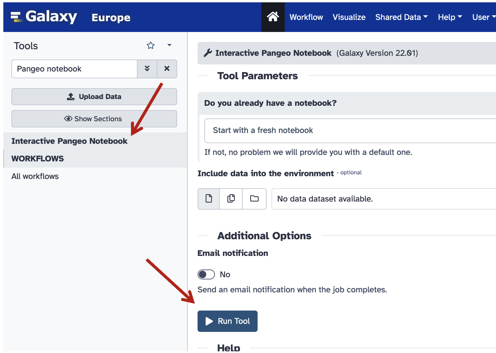
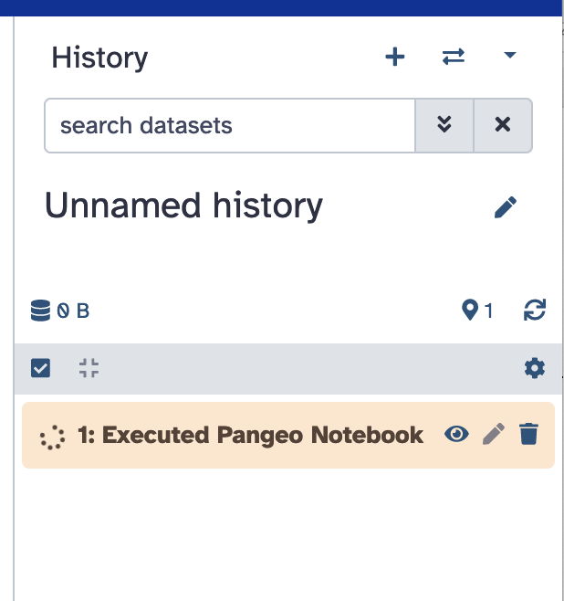
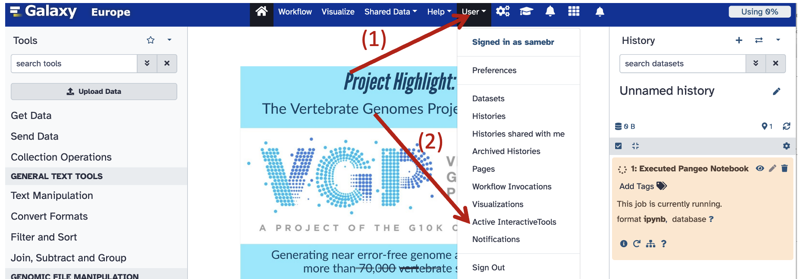
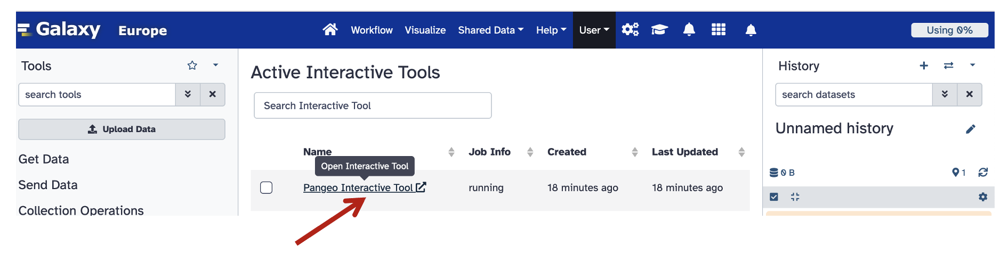
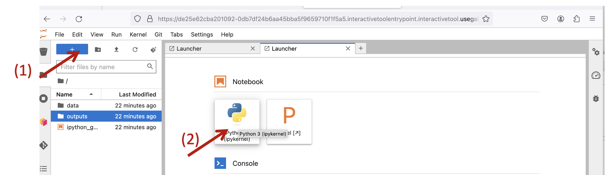
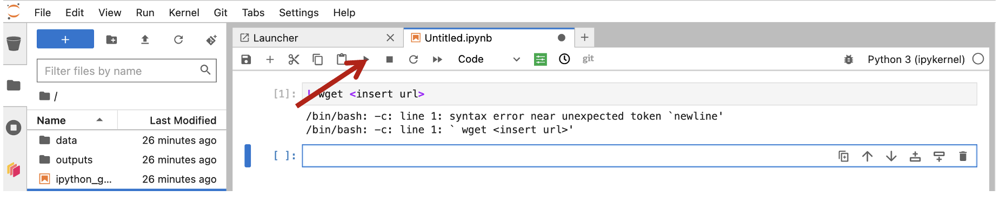

# NORO-school-modelling-practical

## Setting up an account with Galaxy: 
Extra info about getting started with Galaxy:https://galaxyproject.org/get-started/
General about the Galaxy project: https://galaxyproject.org/

(1.) Register here: https://usegalaxy.eu/login/start?redirect=None 

(2.) Check your email and and verify your account

(3.) Under "Tools" to the left, search for "Pangeo notebook" and then click "Interactive Pangeo Notebook"

(4.) In the following window, click "Run tool"





The right panel should look like this: 




(5.) Now click "User" on the top panel, followed by "Active InteractiveTools" in the drop down menu:




(6.) Now click "Pangeo Interactive Tool"




(7.) Now open a notebook by clicking "+" in the top left corner, followed by clickin "Python 3 (ipykernel)" in the appearing window. 




(8.) Now type 
```python
!wget https://zenodo.org/records/10521325/files/sarambl/NORO-school-modelling-practical-version1.1.zip

!unzip NORO-school-modelling-practical-version1.1.zip
```


In the top cell, and then press play to "execute" the cell (run the content). 




(9.) Now open the new file which shows up in the left side panel (inside the new folder). 

(10.) **IMPORTANT:** This online platform will delete all your work if it shuts down (for whatever reason), therefore, download your work regularly. In an ideal setup you would e.g. use a version controle system like git+ github, but here we'll keep it simple. 